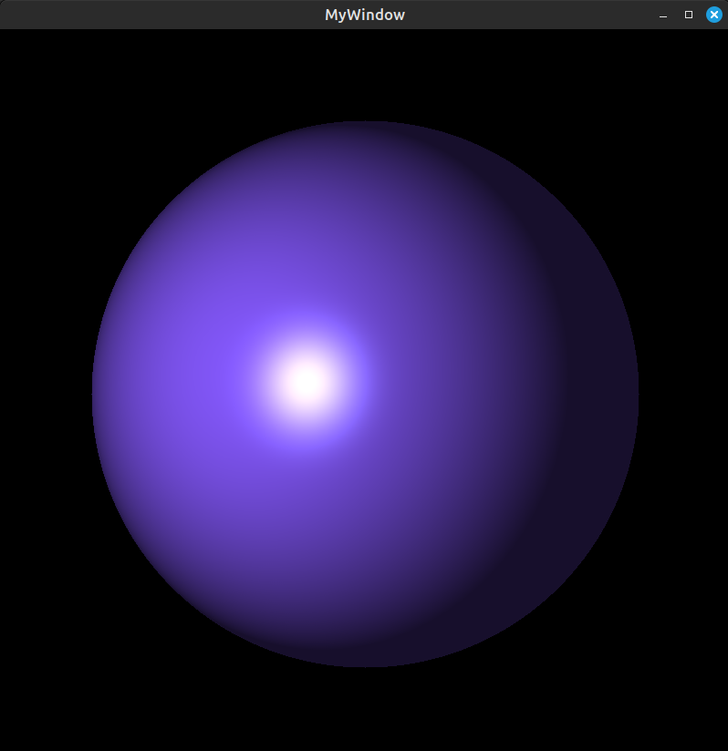

# SPHERE RENDERING
## Description
This program draws a sphere in the window illuminated by a light source. You can set the location of the sphere, its color, the location of the light source and its color.
We use SFML for drawing.

***

## Example



***

## Build and Run

1) To compile, type:
```
make
```
2) To run the project:

```
./output
```
